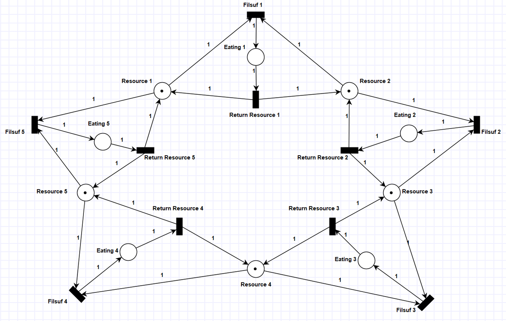

# Dokumentasi Program Lima Filsuf Makan

## Latar Belakang

Masalah Lima Filsuf Makan adalah masalah sinkronisasi klasik dalam ilmu komputer yang menggambarkan lima filsuf yang duduk mengelilingi meja makan. Setiap filsuf memerlukan dua garpu (sumber daya) untuk dapat makan. Tantangannya adalah menghindari deadlock dan starvation saat filsuf mencoba mengakses garpu secara bersamaan.

## Model Petri Net

Program ini didasarkan pada model Petri Net yang dioptimasi dengan karakteristik:

1. Terdapat 5 filsuf dan 5 sumber daya (garpu)
2. Setiap filsuf membutuhkan dua sumber daya yang berdekatan untuk makan
3. Filsuf mengambil dan melepaskan kedua sumber daya secara bersamaan (operasi atomik)
4. Beberapa filsuf dapat makan secara bersamaan jika sumber daya tersedia
5. Model mencegah deadlock melalui pengelolaan sumber daya yang cermat



## Implementasi Program

Program diimplementasikan menggunakan bahasa C dengan PThread untuk menangani konkurensi. Setiap filsuf direpresentasikan sebagai thread terpisah, dan sumber daya direpresentasikan sebagai variabel global yang dilindungi oleh mutex.

### Struktur Program
- Setiap filsuf berjalan dalam thread terpisah
- Mutex digunakan untuk melindungi akses ke sumber daya bersama
- Variabel kondisi digunakan untuk menunggu ketika sumber daya tidak tersedia
- Setiap filsuf berulang melalui siklus: berpikir → mencoba mengambil sumber daya → makan → melepaskan sumber daya

## Cara Menjalankan Program

### Prasyarat
- Compiler GCC
- Library pthread

### Langkah-langkah Kompilasi dan Eksekusi

1. Pastikan file sumber p6_030.c berada di direktori saat ini
2. Kompilasi program dengan perintah:
   ```
   gcc p6_030.c -o dining_philosophers -lpthread
   ```
3. Jalankan program dengan perintah:
   ```
   ./dining_philosophers
   ```

## Hasil Eksekusi

Berikut adalah contoh hasil eksekusi program:


## Analisis

Program berhasil mengimplementasikan solusi untuk masalah Lima Filsuf Makan berdasarkan model Petri Net yang telah dioptimasi. Beberapa pengamatan penting:

1. **Pencegahan Deadlock**: Program berhasil menghindari deadlock melalui pengambilan dua sumber daya secara atomik.

2. **Konkurensi**: Beberapa filsuf dapat makan secara bersamaan saat sumber daya tersedia.

3. **Keadilan**: Algoritma memastikan bahwa tidak ada filsuf yang mengalami kelaparan (starvation) terus-menerus.

4. **Kesesuaian dengan Model**: Implementasi berhasil merefleksikan model Petri Net yang dirancang.

## Kesimpulan

Program Lima Filsuf Makan dengan implementasi PThread berhasil mengatasi masalah sinkronisasi klasik sesuai dengan model Petri Net yang dioptimasi. Program menunjukkan bagaimana konkurensi dapat dikelola dengan aman untuk menghindari kondisi deadlock dan starvation.

## Referensi

1. Silberschatz, A., Galvin, P. B., & Gagne, G. (2018). Operating System Concepts (10th ed.). Wiley.
2. Dijkstra, E. W. (1971). Hierarchical ordering of sequential processes. Acta Informatica, 1(2), 115-138.
3. Petri, C. A. (1966). Communication with Automata. New York: Griffiss Air Force Base Technical Report.

---

Anda dapat mengambil kerangka ini dan menambahkan screenshot hasil eksekusi nyata dari program Anda. Tambahkan juga gambar model Petri Net yang Anda gunakan sebagai dasar implementasi. Pastikan untuk menyusun dokumen dengan format yang baik dalam PDF.